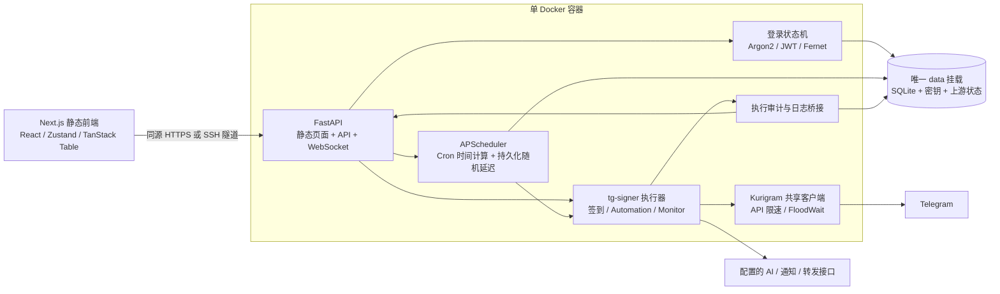

# 架构与维护

## 单容器取舍

Next.js App Router 构建输出 HTML/CSS/JS，页面交互在 React 客户端完成，不需要生产 Node 服务。FastAPI 在 `/` 提供静态内容，在 `/api`、`/ws` 提供后端能力。避免两个 Web 服务之间的端口、CORS、Cookie 与 WS 反向代理配置。最终进程由 Docker init 管理，运行一个 Uvicorn worker。

生产设置要求单实例，任务调度和 Telegram 活跃客户端存在此实例内。SQLite 保存配置、记录和具体下次运行时间；APScheduler 的内存作业可由这些数据重建。横向扩容需要额外的主节点选举与外部任务队列，当前版本不提供多副本部署。

## 任务生命周期

1. Pydantic 对面板调度字段及完整上游配置校验。
2. 数据库事务保存任务。签到任务计算下一次 Cron，并采样随机延迟后持久化。
3. APScheduler 单次日期作业触发；立即记录 running 历史。同一任务重复运行返回 409，同账号签到串行。
4. 复用上游 Telegram API 包装器限制速率并处理 FloodWait，执行动作并捕获目标回复。
5. 对每个目标分别匹配。失败优先；无成功正则为 completed；动作超时和 RPC 异常不能算作成功。
6. 保存运行摘要与原始回复，通过 WS 推送；失败时调用已经配置的通知渠道。
7. Automation / Monitor 持续监听。规则处理有独立审计记录，停止时移除 handler、取消工作并持久化状态。

重启时将尚处于 running 的旧执行记录标记 interrupted，不伪造成功；恢复启用的调度/监听。五分钟内错过的日期作业允许一次补跑，其余计算下一个未来时间。

## 凭据与授权

面板密码使用 Argon2id。JWT 保存在 HttpOnly + SameSite=Strict Cookie，默认 12 小时有效；修改密码后数据库 token_version 改变，旧令牌即时失效，包括现有 WS 后续心跳检查。

状态变更请求检查 Origin / Sec-Fetch-Site；WS 校验 Cookie 与 Origin。Swagger 和 OpenAPI 也需要登录，健康检查可匿名。面板登录、Telegram 发码/验证均限频。

Telegram 登录使用内存客户端，待登录流程十分钟失效、内存保存、定期清理；成功后才加密入库。`.session` 上传有大小和格式限制，保存在私有临时目录，验证后立即清理。会话导出只提供给已登录管理员，响应禁止缓存。

`data/encryption.key` 用于 Fernet；`data/jwt.key` 用于 HS256。密钥由系统随机生成、文件模式 0600，数据目录 0700，代码、文档、测试和镜像均不包含真实凭据。API 的账号列表不返回 Session/API_HASH。通知配置密钥返回掩码，编辑保存掩码会保留旧值。

日志包含 Telegram 原文，属于管理员可见的私有数据。终端内存保留最近 500 条，客户端最多显示 1000 条，每个 WS 队列上限 200。SQLite 执行历史持久保留，宿主机应结合业务量安排备份与归档。

## 数据持久性

`data/dashboard.sqlite3` 为面板主数据库，WAL + busy timeout；`data/upstream/data.sqlite3` 为上游兼容签到记录。配置元数据和原始回复分开保存。任务删除后运行记录保留名称快照；账号存在绑定任务时拒绝删除。

原始上游配置可从网页导出并用于 CLI；面板调度、正则与账号关联仅存在 dashboard SQLite，完整备份须包含整个 data 目录与密钥。数据加密无法在密钥丢失后恢复。

## 外部依赖验证

真实外部接口均已接入代码；自动化测试隔离 Telegram/通知网络调用。图片识别和计算题依赖支持相应能力的模型，Folder/成员查询受 Telegram 对话可见性和管理员权限限制，代理需由容器能访问。

容器中的 `127.0.0.1` 指容器自身。使用宿主机代理时须填容器可达的宿主机网关地址，或显式配置 host-gateway；本项目不会读取或改动宿主机现有代理。

实时日志优先连接 `/ws/logs`。网络或反向代理无法建立 WebSocket 时，浏览器自动使用 `EventSource` 连接 `/api/logs/stream`；后端同样校验 JWT，发送 history/log 事件和心跳。WS 恢复后关闭 SSE，避免重复日志。
